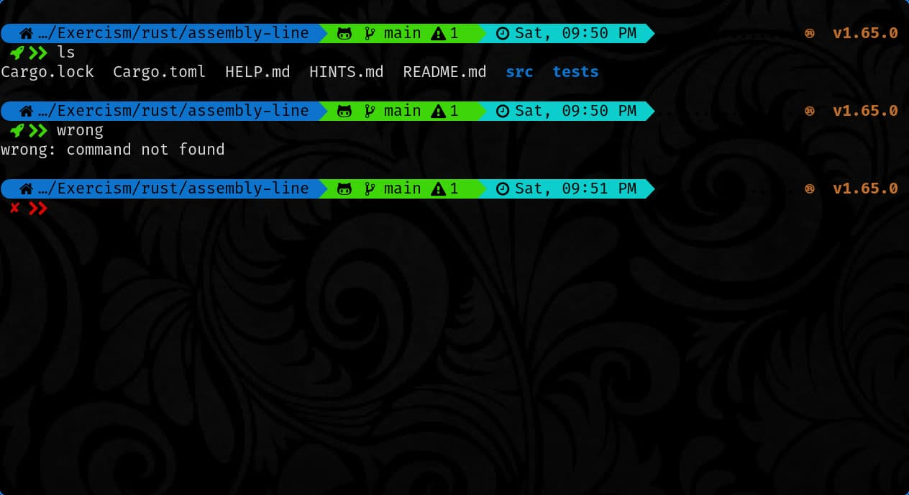

<div align = "center">

<h1><a href="https://github.com/2kabhishek/starship2k">starship2k</a></h1>

<a href="https://github.com/2KAbhishek/starship2k/blob/main/LICENSE">
 </a>

<a href="https://github.com/2KAbhishek/starship2k/graphs/contributors">
 </a>

<a href="https://github.com/2KAbhishek/starship2k/stargazers">
</a>

<a href="https://github.com/2KAbhishek/starship2k/network/members">
 </a>

<a href="https://github.com/2KAbhishek/starship2k/watchers">
 </a>

<a href="https://github.com/2KAbhishek/starship2k/pulse">
 </a>

<h3>Make Your Shell Shine 🌟🐚</h3>

<figure>
  
  <br/>
  <figcaption>starship2k screenshot</figcaption>
</figure>

</div>

starship2k is a shell prompt based on starship prompt.

## ✨ Features

- Powerline support
- Exhaustive git prompt
- Support for multiple languages
- Multiline prompt

## Setup

### ⚡ Requirements

- [starship](https://github.com/starship/starship)
- a shell of your choice

### 🚀 Installation

```bash
git clone https://github.com/2kabhishek/starship2k
cd starship2k
ln -sfnv $PWD/starship.toml ~/.config/
```

### 💻 Usage

```bash
# bash, append to ~/.bashrc
eval "$(starship init bash)"

# zsh, append to ~/.zshrc
eval "$(starship init zsh)"
```
For more details check the [setup section on starship](https://github.com/starship/starship#step-2-setup-your-shell-to-use-starship)

##  Behind The Code

### 🌈 Inspiration

Wanted to do a comparison between [oh-my-posh](https://github.com/jandedobbeleer/oh-my-posh) and [starship](https://github.com/starship/starship) for a better cross platform option.
Both have their pros and cons.

For my oh-my-posh config, check out [Posh2K](https://github.com/2kabhishek/Posh2K)

### 💡 Challenges/Learnings

- Learned about starship configuration format, found oh-my-posh to be more intuitive.

### 🧰 Tooling

- [Dotfiles](https://github.com/2kabhishek/Dotfiles) — Dev Environment
- [nvim2k](https://github.com/2kabhishek/nvim2k) — Personalized Editor

### 🔍 More Info

- [Posh2K](https://github.com/2kabhishek/Posh2K) My oh-my-posh configs

<hr>

<div align="center">

<strong>⭐ hit the star button if you found this useful ⭐</strong><br>

<a href="https://github.com/2KAbhishek/starship2k">Source</a>
| <a href="https://2kabhishek.github.io/blog" target="_blank">Blog </a>
| <a href="https://twitter.com/2kabhishek" target="_blank">Twitter </a>
| <a href="https://linkedin.com/in/2kabhishek" target="_blank">LinkedIn </a>
| <a href="https://2kabhishek.github.io/links" target="_blank">More Links </a>
| <a href="https://2kabhishek.github.io/projects" target="_blank">Other Projects </a>

</div>

